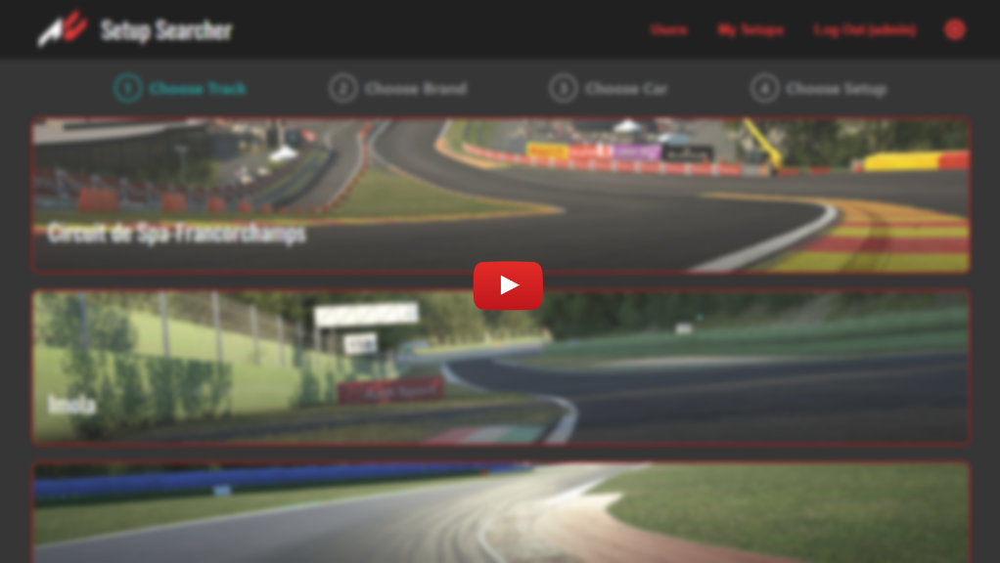

# wieik-ssi-project<!-- omit in toc -->
Project implemented withing the framework of a subject *Network Information Systems*.

## Table of Contents <!-- omit in toc -->
- [Goal](#goal)
- [Terminology](#terminology)
- [Demo](#demo)
- [Features](#features)
- [Technologies](#technologies)

---

## Goal
Simple application supporting sharing and searching **setups** used in game **Assetto Corsa Competizione**.

## Terminology
- **Assetto Corsa Competizione** - Sports car racing simulator.
- **setup** - File containing configuration of a specific car (i.e. bump stops, cambers, casters etc.).

## Demo

## Features
- **Shared**
  - support for light and dark theme
- **Guest**
  - searching setups by track and a car
  - downloading setups
  - login
  - creating account
- **User**
  - uploading setups
  - deleting setups
- **Admin**
  - blocking users

## Technologies
- React
- TypeScript
- PostgreSQL
- TypeORM
- Express.js